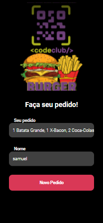
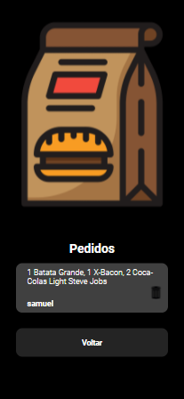

 

<!-- ABOUT THE PROJECT -->
<h2 id="about-the-project"> :pencil: Sobre o projeto</h2>

 
  Um projeto simples em react com objetivo de treinar o conhecimneto de back-end e front com React, funcionalidade do projeto é armazenar o pedido e o nome do cliente 

